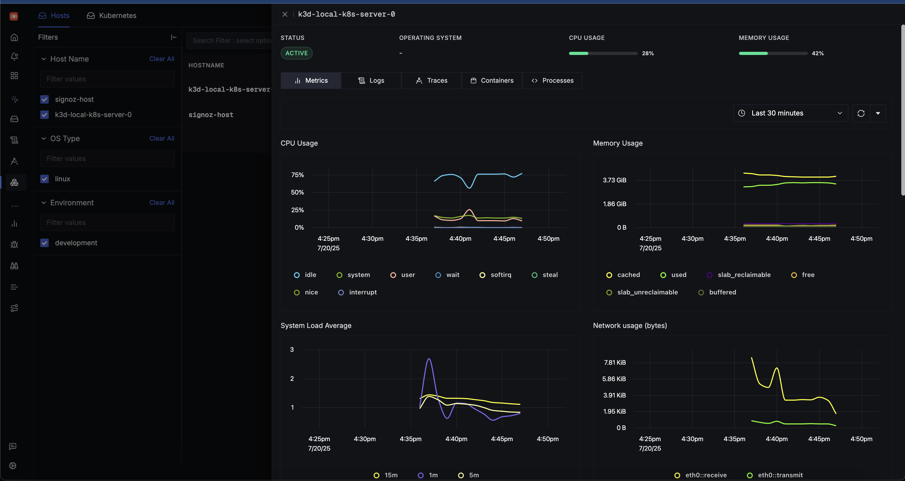
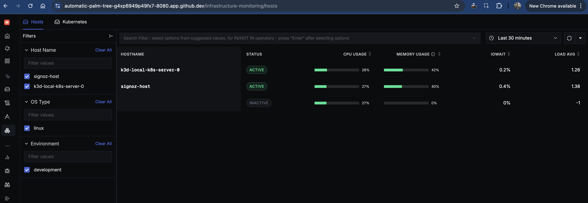
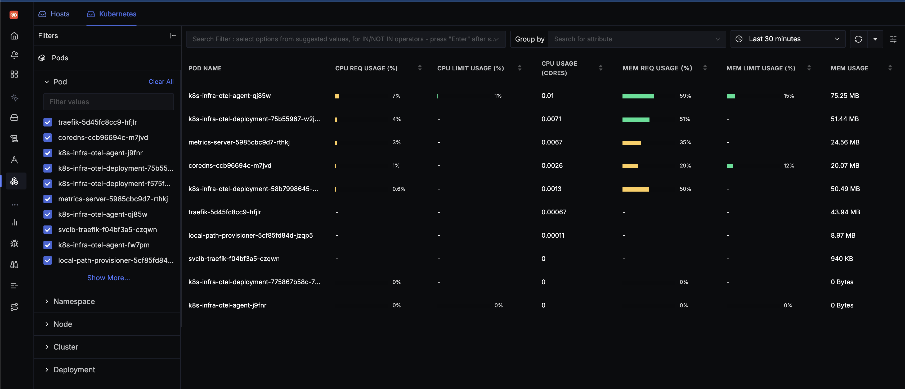

# INFO8985-Inclass-task-4

Complete observability setup with SigNoz, k8s-infra monitoring, and instrumented Flask app





## Quick Start

```bash
pip install ansible kubernetes
git submodule update --init --recursive
ansible-playbook up.yml
```

This deployment includes:

- **SigNoz** observability platform (Docker Compose)
- **k8s-infra** monitoring stack (Kubernetes Helm chart)
- **Rolldice Flask app** with OpenTelemetry instrumentation

## Architecture

```
Rolldice App → k8s-infra OTEL Collector → SigNoz → Visualization
```

**Components:**

- **Rolldice App**: Flask application with traces, metrics, and logs
- **k8s-infra**: Kubernetes monitoring with OTEL collectors
- **SigNoz**: Observability platform for data storage and visualization

## Access Points

- **SigNoz UI**: http://localhost:8080
- **Rolldice App**: http://localhost:5000/rolldice
- **Kubernetes**: `kubectl get pods -n default`

## Testing Telemetry

```bash
# Generate test data
curl "http://localhost:5000/rolldice?player=alice"

# Generate load test
for i in {1..50}; do curl http://localhost:5000/rolldice; done
```

Verify telemetry in SigNoz UI → Services → `rolldice-app`

## Configuration

Edit `override-values.yaml` to customize:

- `otelCollectorEndpoint`: SigNoz collector endpoint
- `global.clusterName`: Your cluster identifier
- `global.deploymentEnvironment`: Environment name

## Documentation

- **[TESTING.md](TESTING.md)**: Comprehensive testing guide
- **[ROLLDICE-INTEGRATION.md](ROLLDICE-INTEGRATION.md)**: Detailed integration guide
- **[project.md](project.md)**: Complete project analysis

## Teardown

```bash
ansible-playbook down.yml
```

## Learning Objectives

This setup demonstrates:

- **Infrastructure as Code**: Ansible automation
- **Kubernetes Monitoring**: k8s-infra Helm chart deployment
- **Application Observability**: OpenTelemetry instrumentation
- **End-to-end Telemetry**: Complete traces, metrics, and logs pipeline
